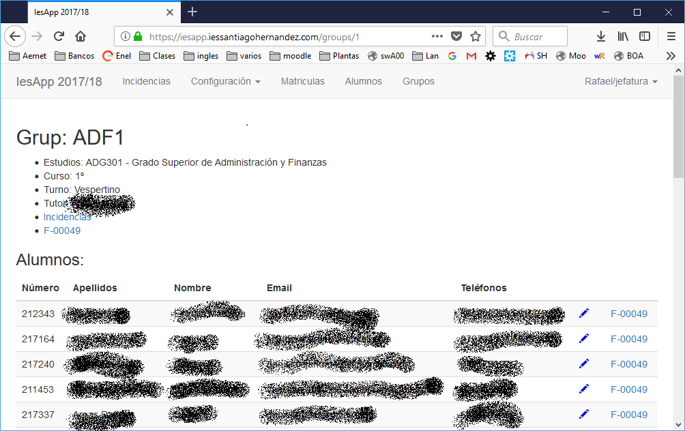

## Datos de alumnos. F-00049

- El formato F-00049 es usado en el proceso de recepción de alumnos.
- IesApp además cruza datos con SIGAD y nos muestra aquellos que no son coincidentes.
- El F-00049 se puede descargar en la hoja del grupo, siempre y cuando seamos el tutor.

### PDF
- El F-00049 se puede descargar en pdf 
 - De forma general para todo el grupo en la parte superior
 - De forma individualizada en la parte derecha de cada alumno.

### Pantalla

- El icono del lapicero nos muestra una pantalla semejante al F-00049 sin necesidad de descargar el ficher PDF.