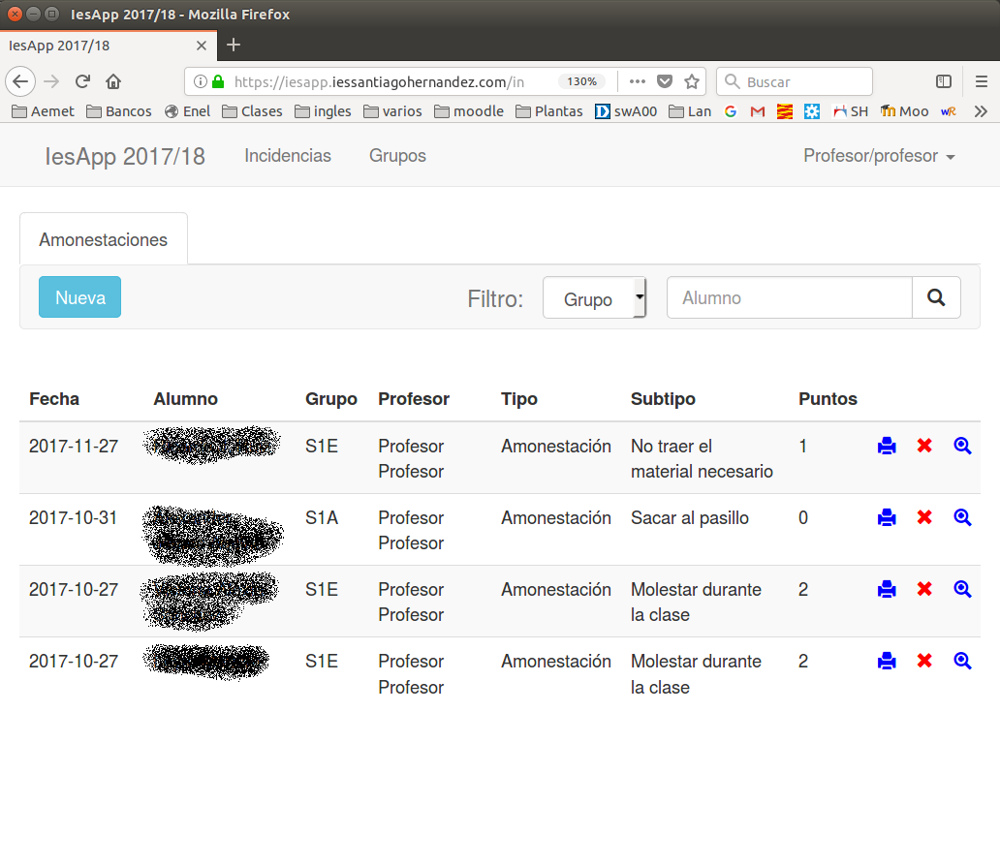
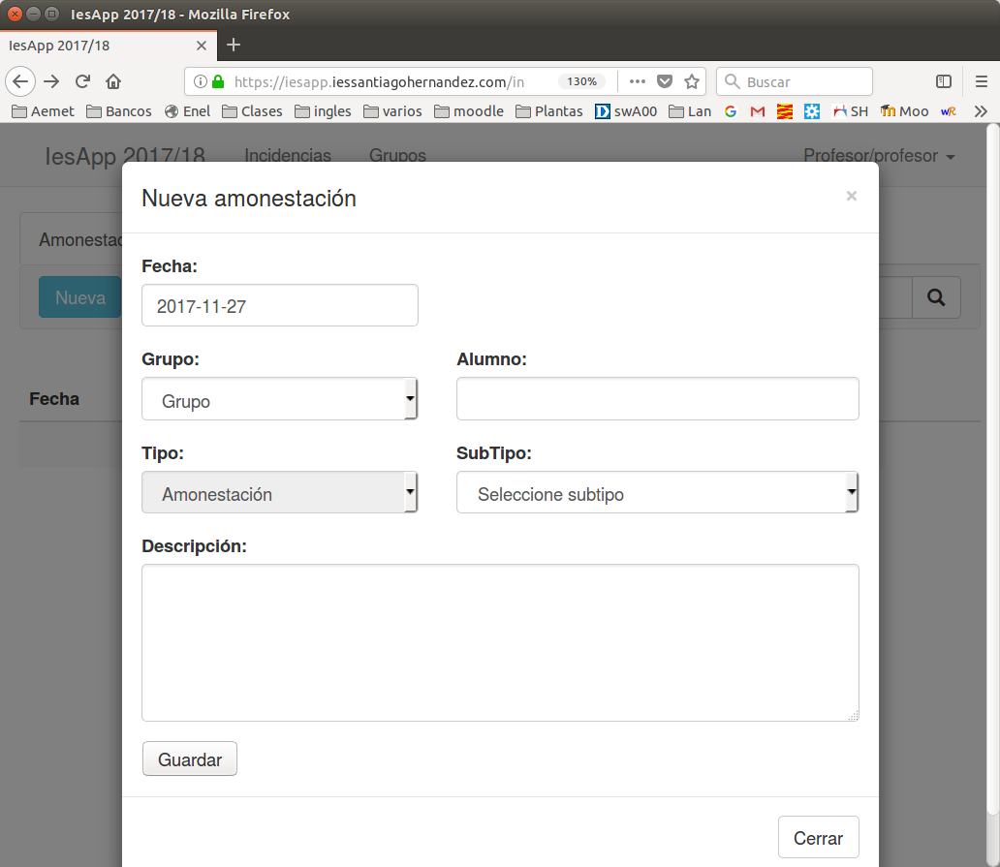

# Incidencias

## Ver Incidencias

- Un usuario profesor ve la lista de todas las incidencias que ha puesto en el curso actual

- Desplegando en la lista de grupos puede ver las de un sólo grupo

- Escribiendo en la casilla _Alumno_ puede ver las de un alumno en concreto.

## Nueva incidencia

* Desde la pantalla de incidencias pulsamos el botón _Nueva_ 
* Nos aparecerá la siguiente pantalla:

* Fecha: podemos modificarla, de inicio se rellena la del día actual.
* Grupo: es opcional, lo podemos usar para facilitar la búsqueda del alumno.
* Alumno: iniciamos la escritura de su nombre o apellido y se desplegará una lista de los alumnos que se ajustan a lo y escrito. Finalmente elegimos el nombre del alumno.
* Tipo: para el profesorado común sólo se pueden registrar amonestaciones.
* Subtipo: Aquí debemos elegir el que más se ajuste al problema discipinario que se quiere registrar.
* Descripción: para acabar debemos escribir una descripción de los hechos lo más clara y concisa que podamos.

## Acciones sobre incidencias

* En la lista de incidencias aparecen tes iconos:
* La impresora nos permite descargar o imprimir el documento pdf de la incidencia.
* La cruz roja nos permite eliminar la incidencia.
* La lupa nos permite ver el detalle de la incidencia y editarla.

## ¿Qué debo hacer con la amonestación?

### Alumnos de 1º, 2º y 3º de ESO

* Es suficiente con registrar la amonestación
* Jefatura de estudios se encarga de su contabilidad y de sancionar al alumno si es preciso.

### Alumnos de 4º de ESO, Bachillerato y FP.

Se deben seguir los siguientes pasos:

1. Imprimir tres copias y firmarlas.
2. Copia 1, se entrega tal cual al tutor
3. Copia 2 y 3 son firmadas por jefatura de estudios.
4. Las copias 2 y 3 se entregan al alumno. Una debe guardar la y la otra debe devolverla al tutor firmada por sus padres si es menor de edad o por él mismo si ha cumplido los 18 años.
5. La copia firmada por el alumno o sus padres se entrega en Jefatura de Estudios
