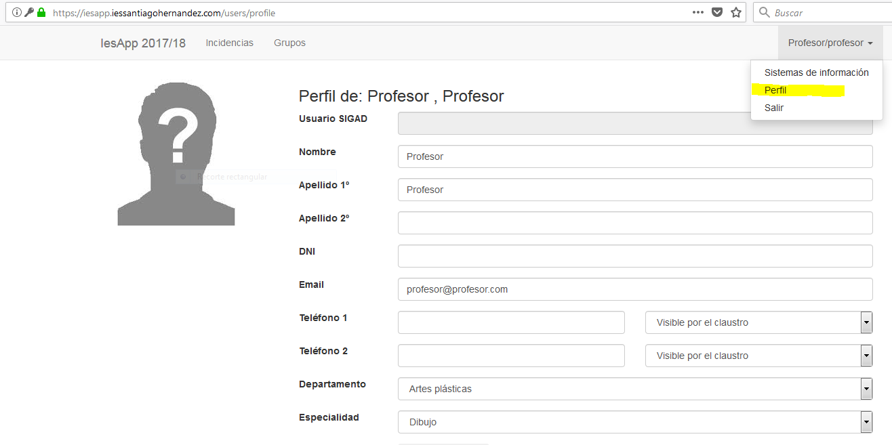

# Perfil de Profesor

- Donde. En el menú duperior derecho, aparece un enlace al perfil personal
- En ella aparece la información que se considera básica para el funcionamiento de la aplicación.
- La siguietne información será visible para el resto del claustro:
	- Nombre y apellidos
	- Email
	- Departamento y especialidad
- Los números telefónicos se harán públicos al resto del claustro según los elijamos en la propia pantalla.
- Información sólo accesible para la dirección y administración del centro:
	- DNI
	- Usuario de SIGAD

